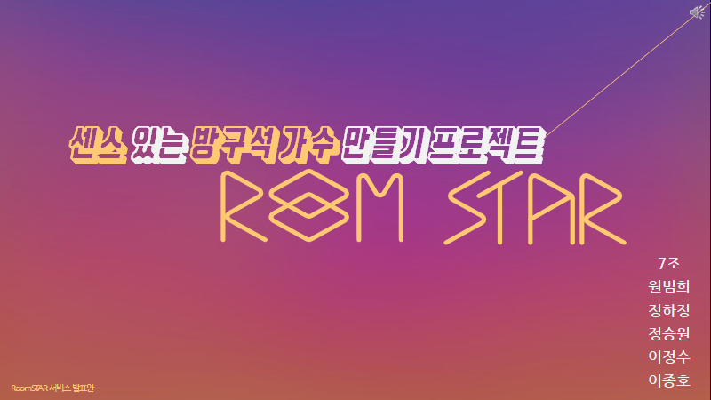

# 룸스타 RoomSTAR

"Show your voice, Shine like a star."

  
  
  
  

프로젝트명: 실시간 스트리밍 노래대결 웹/앱
구현 방법: 
-  Front-End: Vue.js를 사용하여 반응형 웹 앱 개발, Socket I/O를 통한 실시간 스트리밍 서비스 구현
-  Back-End: Spring Boot, MariaDB 사용
-  Storage: Firebase Starage를 사용한 파일 업로드 / 다운로드 기능 구현
-  Server: AWS EC2 배포
실시간 스트리밍을 통해 사용자 2명이 노래 대결을 펼치면 시청자들이 실시간 투표를 통해 승/패를 가리는 웹/앱서비스 구현

