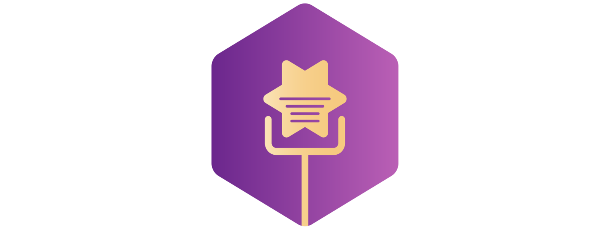

# :star2: 룸스타 RoomSTAR :star2:

"Show your voice, Shine like a star."

  
  
  
  

## 목차

1. [RoomSTAR?](#RoomSTAR?)

2. [개발환경](#개발환경)

3. [소개영상](#소개영상)

4. [기능소개](#기능소개)

5. [팀원소개](#팀원소개)

6. [부록](#부록)

   ​     

## RoomSTAR?

**RoomSTAR**는 Socket I/O를 통한 **실시간 스트리밍 노래배틀** 반응형 Progressive Web App입니다. 문의사항이 있으신 경우 e-mail로 연락바랍니다.

makeartweek@gmail.com

## 개발환경

##### Front-End 

Vue.js, Socket.io, WebRTC

##### Back-End

Spring Boot, MariaDB

##### Storage

Firebase Starage를 사용한 이미지/동영상 파일 업로드/다운로드 기능 구현

##### Server

AWS EC2

##### Network

Node.js 

Socket.io

## 소개 영상

<video src="">
</video>

## 기능 소개

##### 노래선택

##### 사용자관점

- 선택 노래 재생

##### 시청자관점

- 투표
- 채팅

## 개발자소개

## 부록

"from `Artweek` import `inspiration`"